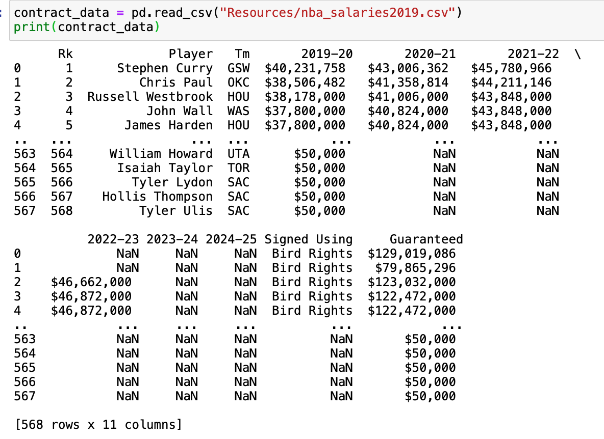
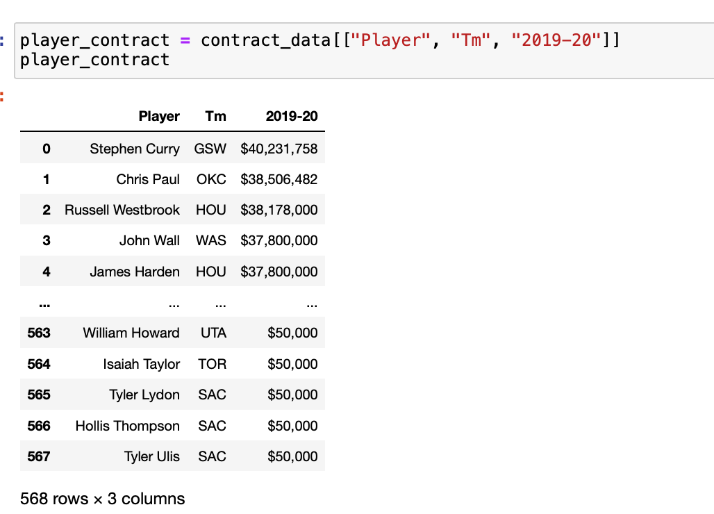
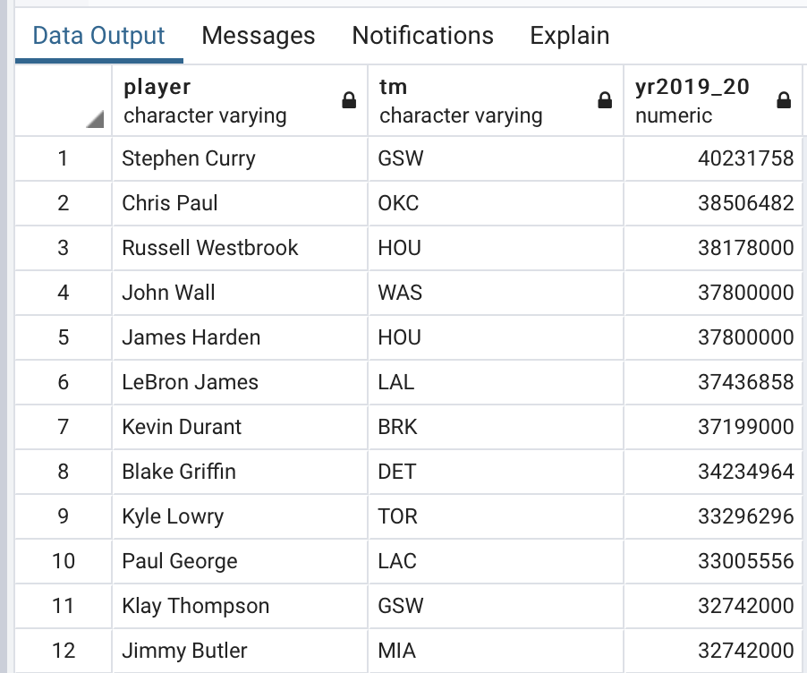
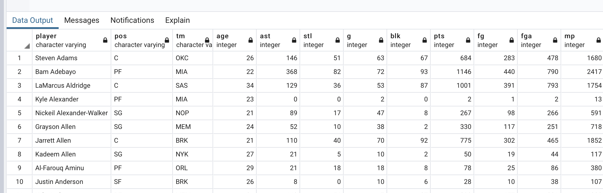
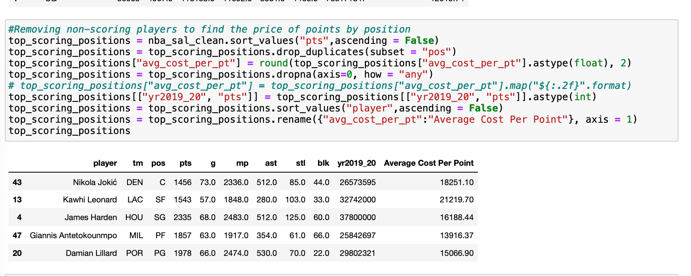
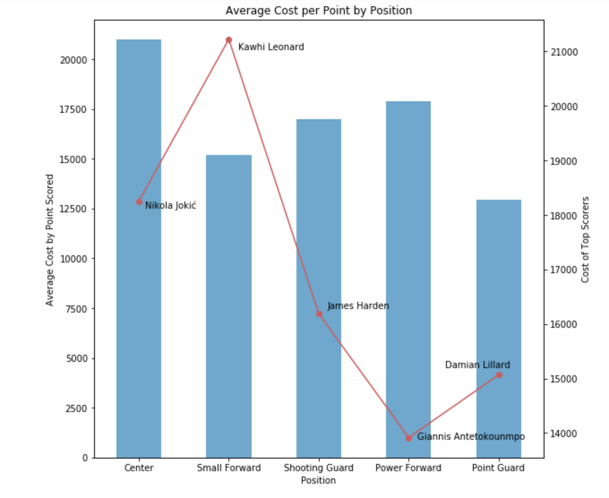
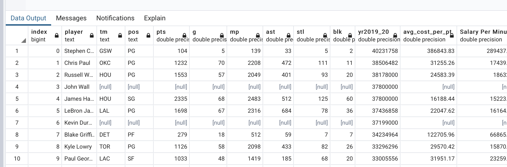

# ETL_project

In this project, we analyzed National Basketball Association ("NBA") players’ 2019-20 salary and average points per game to determine which contracts were overvalued. 

Note, the NBA salary cap was set at $109.14 million for the 2019-20 season. The salary cap is the limit to the total amount of money teams are allowed to pay their players. The purpose of the cap is to control cost and maintain competitive balance between small and large market teams.  

## Extraction: ##
Two tables were extracted from the [basketball-reference](http://www.basketball-reference.com) webpage for the 2019-20 basketball season: [player stats](https://www.basketball-reference.com/leagues/NBA_2020_totals.html) and [player salaries](https://www.basketball-reference.com/contracts/players.html). 

We saved the data as a csv file in resources as 'player_contracts2019' and 'nba_salaries2019'. 

Using pandas, we selected only the columns we needed and saved them as "stat2019_clean.csv" and "salary_clean.csv".

In PostgreSQL, we created a database ("basketball") and two tables "stats" and "salary". We imported the csv files into the tables/database. 

## Transformation: ##
The nba_salaries2019.csv file was pulled into a dataframe ("contract_data") and all columns were removed except: Player, Team, and Salary (see csv file "Salary_clean" in the Resources folder). We pulled the player_stats.csv file into a dataframe ("player_data") (see csv file "stat2019_clean" in the Resources folder). 

Using pandas, we loaded the sql files, "salary_clean" and "player_data" and merged them into a single dataframe ("nba_sal") with the columns: Player, Team, Position, and Salary. 

In some cases, players appeared on duplicate rows. This was a result of being traded during the season. Only the first instance of each player was kept, and other duplicate rows were dropped. The first instance was sufficient for the analysis because salary data remained constant across duplicate instances. The dataframe was renamed "nba_sal_clean".

Our group was interested in determining efficiency of players. We created new columns in the "nba_sal_clean" dataframe to analyze "Average Cost per Point" and "Cost per Minute Played". These columns allowed us to compare NBA players by salary, position, and points scored. Depending on team allocations, the player positions were combinations of "Center", "Power Forward", "Small Forward", "Shooting Guard", and "Point Guard". We renamed each variation to streamline the data into five, clearly defined positions. We calculated the average salary earned by position and visualized it as a bar chart. We then juxtaposed those averages against the top point scorers by position as a line chart. 

The gap in salary per point in league average by position compared to the top scorers by position was remarkable, with the average "Small Forward" being paid nearly $10,000 less per point scored than the leading Small Forward, Kawhi Leonard.

## Load: ##

After cleaning and transforming our merged data in Pandas, we compiled all new data compiled ("Average Cost per Point" and "Cost per Minute Played") into the DataFrame "nba_sal_clean". This dataframe was exported using df.to_sql into the "basketball" database into a new table, "final_table".

## Contributors: ##
Thanks to the following people who have contributed to this project:
* @AmberGershman
* @frangipani99
* @gportes24
* @HIna-Ahmad

